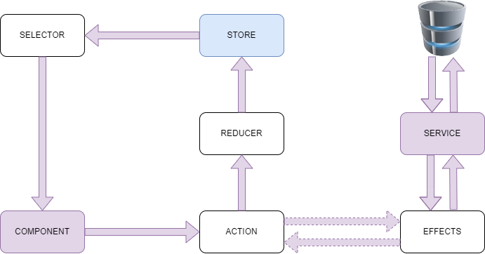

<pre>
  _   _  _____ _____  __   __  _______ _____            _____ _   _ _____ _   _  _____ 
 | \ | |/ ____|  __ \ \ \ / / |__   __|  __ \     /\   |_   _| \ | |_   _| \ | |/ ____|
 |  \| | |  __| |__) | \ V /_____| |  | |__) |   /  \    | | |  \| | | | |  \| | |  __ 
 | . ` | | |_ |  _  /   > <______| |  |  _  /   / /\ \   | | | . ` | | | | . ` | | |_ |
 | |\  | |__| | | \ \  / . \     | |  | | \ \  / ____ \ _| |_| |\  |_| |_| |\  | |__| |
 |_| \_|\_____|_|  \_\/_/ \_\    |_|  |_|  \_\/_/    \_\_____|_| \_|_____|_| \_|\_____|
</pre>
# Purpose
This repository contains a simple example on how to use `ngrx` in Angular. 
As example is a list of books, which are retrieved from an API and can be added to a collection, and removed as well. 
Described below is a summary of my findings from different sources, which lead to the example app. 
If you want a more detailed guide, look ath the [Step-by-step tutorial](#step-by-step-tutorial).

# Sources
https://ngrx.io/ 
https://www.angulararchitects.io/aktuelles/reaktives-state-management-mit-ngrx-redux/ 
https://blog.logrocket.com/angular-state-management-made-simple-with-ngrx/

# Step-by-step tutorial
<a href="https://lachi90.github.io/ngrx-training/" target="_blank">Step-by-step tutorial</a>

# Run
## Live Demo
<a href="https://stackblitz.com/github/Lachi90/ngrx-training/tree/main/ngrx-training" target="_blank">Run on Stackblitz.com</a>

## Locally
### First time use
`npm install`

### Run application
`ng serve`

# Know How
## State Management Lifecycle

## General Explanation
### Actions
> Actions are events which are triggered throughout the appliction. This could be user interactions or network requests.

### Reducers
> Reducers are responsible to transition the state from one to the next. Reducers have functions which are trigger on base of the action's type.

### Selectors
> Selectors are pure functions used for obtaining slices of the store state.

# Development Parts
## Packages added
- @ngrx/store@14.0.2

## Actions
### Book Action
The `books.actions.ts` defines two [action groups](#action-group). The first for adding and removing books and the second one for the book API. 
`source` is the group name. 
`events` represents a list of actions. The key is the action name. 
The `props` method is used to define any additional metadata needed for the handling of the action.

## Reducer
- Book Reducer
- Collection Reducer

### Reducers explained
The two reducers work by the same principle. The `createReducer` function retrieves the initial [state](#store-and-state) as there first parameter. 
Every other parameter are action handlers, they are represented by the `on` function. As first paramter the action name is passed (which is part of the actions ts file). The second paramater handles the state transition. 

## Selector
### Book Selector
The `createFeatureSelector` is a method for returning a top level feature state. It returns a typed selector function for a feature slice of state. 
The `createSelector` function can be used to select some data from the state based on several slices of the same state.
More info see: [Selectors](https://ngrx.io/guide/store/selectors)

## Services
### Books Service
The book service is used to fetch data from a real API, the google books api.

## Components
### BookList Component
The BookList a component which displays the books which were retrieved from the book service. Also provides functionality to add books to the collection. 

### BookCollection Component
The BookCollection is a component which displays the books, which were added to the collection by the BookList component. Also provides functionality to remove books from the collection. 

### App Component
The App component holds the BookList and BookCollection component. It is responsible to call the service to fetch the book data and also for triggering state changes, when books are added or removed from the collection. 
By calling `this.store.dispach()` the respective reducer gets triggered, which then executes the state transition.

# Glossary
## Action Group
An action group is used to group various actions with the same source.

## Store and State
The store is the place where the current state of the application is held/stored.